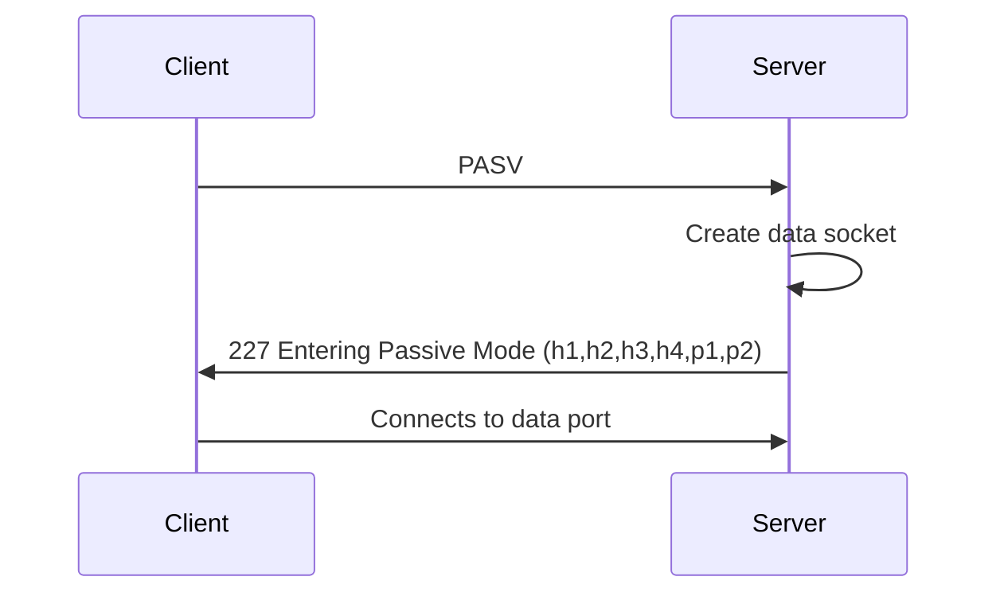
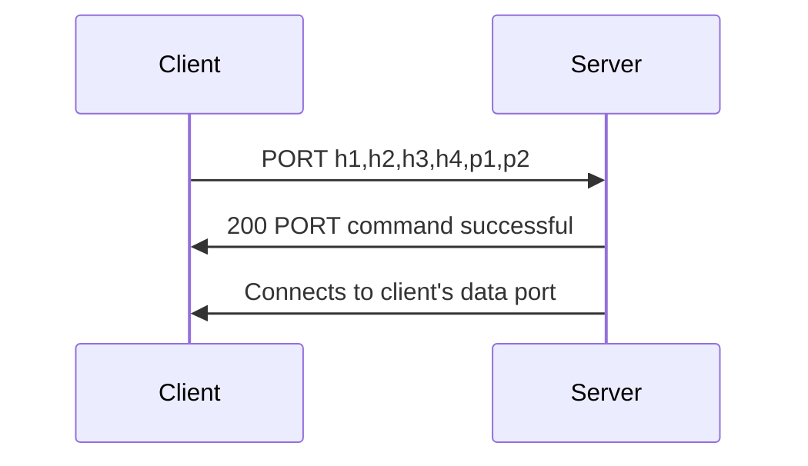

# FTP Protocol Implementation

## Control Connection
- Command syntax
- Response format
- State management

## Data Connection
### Passive Mode (PASV)

```mermaid
sequenceDiagram
    Client->>Server: PASV
    Server->>Server: Create data socket
    Server->>Client: 227 Entering Passive Mode (h1,h2,h3,h4,p1,p2)
    Client->>Server: Connects to data port
```

### Active Mode (PORT)

```mermaid
sequenceDiagram
    Client->>Server: PORT h1,h2,h3,h4,p1,p2
    Server->>Client: 200 PORT command successful
    Server->>Client: Connects to client's data port
```